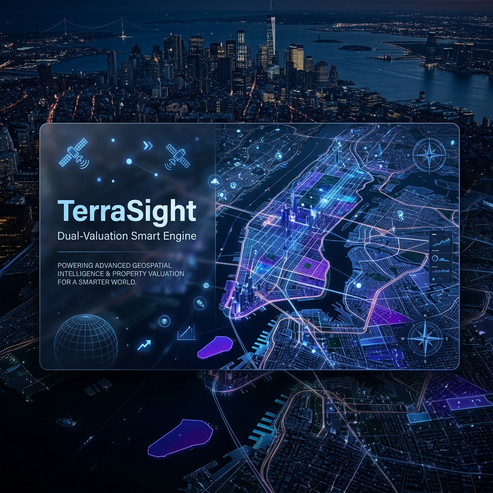

# TerraSight 🌍
### Dual-Valuation Smart Engine | Geospatial Intelligence Platform



TerraSight is a premium geospatial intelligence platform designed to revolutionize land valuation and investment analysis. By merging official government circle rates with real-time amenity density data, TerraSight provides a "Dual-Valuation" insight that helps investors identify undervalued land parcels and high-growth opportunities.

---

## ✨ Key Features

- **🚀 Dual-Valuation Engine**: Instantly compare **Official Government Rates** (IGRS) with **Estimated Market Values** driven by local amenity density.
- **🗺️ Interactive Map Intelligence**: High-performance Leaflet-based mapping with seamless toggling between detailed Street views and Esri Satellite imagery.
- **🛰️ Amenity Radar**: Automatically scans a 2km radius for essential infrastructure including Schools, Hospitals, Transit Hubs, Markets, Gyms, and Parks.
- **📐 Smart Unit Converter**: Seamlessly switch between **Sq.Ft**, **Sq.M**, and **Gaj** with real-time mathematical state synchronization.
- **📱 Premium Mobile Experience**: Physics-based "Bottom Sheet" interface powered by Framer Motion, offering a native-app feel with 1:1 sliding gestures.
- **🔍 Geographic Intelligence**: Smart search suggestions biased specifically towards Uttar Pradesh, India, using custom Nominatim bounding box logic.

---

## 🛠️ Tech Stack

### Frontend
- **Framework**: [React 19](https://react.dev/) + [Vite](https://vitejs.dev/)
- **Styling**: [Tailwind CSS](https://tailwindcss.com/) (Glassmorphism & Custom Tokens)
- **Animation**: [Framer Motion](https://www.framer.com/motion/)
- **Mapping**: [Leaflet](https://leafletjs.com/)

### Backend
- **Framework**: [FastAPI](https://fastapi.tiangolo.com/) (Python 3)
- **Database**: [SQLite](https://sqlite.org/) with SQLAlchemy ORM
- **API Clients**: [HTTPX](https://www.python-httpx.org/) (Async Overpass API requests)
- **Geospatial Logic**: Haversine distance algorithms for proximity analysis

---

## 🚀 Getting Started

### 1. Clone the Repository
```bash
git clone https://github.com/Baymax1705/TerraSight.git
cd TerraSight
```

### 2. Backend Setup
```bash
cd backend
python -m venv venv
source venv/bin/scripts/activate  # Windows: venv\Scripts\activate
pip install -r requirements.txt
uvicorn main:app --reload
```

### 3. Frontend Setup
```bash
cd frontend
npm install
npm run dev
```

---

## 🌐 Deployment

### Backend (Render)
- **Build Command**: `pip install -r requirements.txt`
- **Start Command**: `uvicorn main:app --host 0.0.0.0 --port $PORT`
- **Root Directory**: `backend`

### Frontend (Vercel)
- **Framework Preset**: `Vite`
- **Root Directory**: `frontend`
- **Environment Variables**: Set `VITE_API_URL` to your Render backend URL.

---

## ⚖️ Disclaimer
TerraSight provides estimated land valuations based on public datasets and geospatial proximity analysis. All data provided is for informational purposes only and should not be considered as official legal or financial advice. Users are advised to verify all rates and property details with official government records before making any investment decisions.

## 📝 License
This project is licensed under the MIT License - see the LICENSE file for details.

---
*Developed with ❤️ for Smart Land Intelligence.*